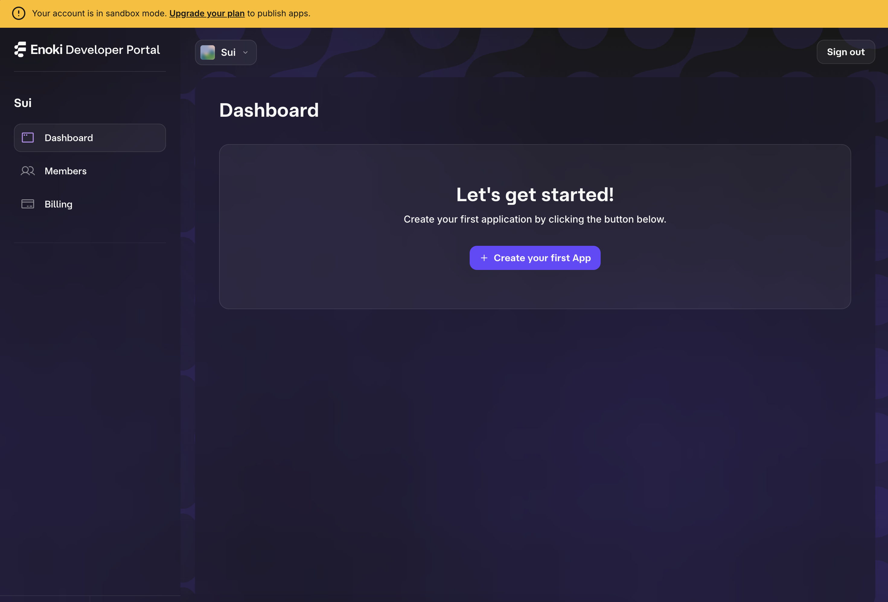
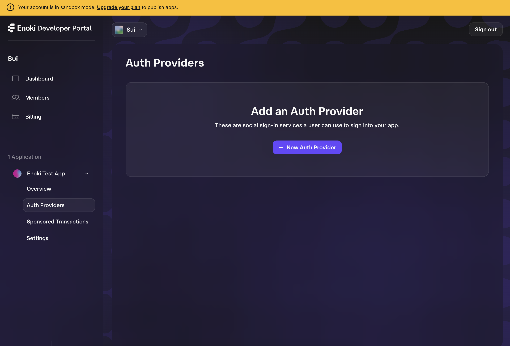
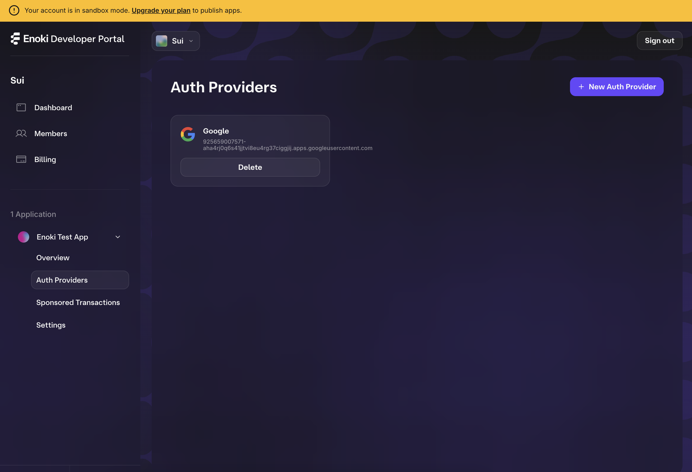

# Enoki Example App
This is a simple, one-page app that integrates with Mysten Lab's Enoki. The live demo can be foud [here](https://enoki-example-app.vercel.app).

## Table of Contents
- [Enoki Example App](#enoki-example-app)
  - [Table of Contents](#table-of-contents)
  - [Enoki Dev Portal Setup](#enoki-dev-portal-setup)
    - [Setting up Enoki API keys](#setting-up-enoki-api-keys)
    - [Setting up your Enoki Auth Provider](#setting-up-your-enoki-auth-provider)
    - [Setting up Enoki Sponsor Transactions](#setting-up-enoki-sponsor-transactions)
  - [Running the app locally](#running-the-app-locally)

## Enoki Dev Portal Setup
### Setting up Enoki API keys
In order to use Enoki, you need to sign into the Enoki Dev Portal and set up your new project. Below are the steps required for this. 

1. Navigate to the [Enoki Dev Portal](https://portal.enoki.mystenlabs.com) and sign in with the email you want to manage your project with. 

    Note, that during your first time signing in, you'll be asked to provide some info to help Mysten Labs keep informed about who is using Enoki. 

    The portal should look something like this when you successfully log on: 
    

2. Click `+ Create your first App` and enter the name of your app. 

    You should see your project's page on the portal now:
    

3. Click `+ Create new` under `New API Key`. 

    You will be given a prompt that looks like this: 
    

    You'll need to select the following: 

    - API key type: 
      - [ ] Public: Select this type if you plan on using this key in a client-side app
      - [ ] Private: Select this type if you plan on using this key in a private backend server

    - Enabled networks: The Sui networks that this api key will work on
      - [ ] Devnet
      - [ ] Testnet
      - [ ] Mainnet - Note this will only work for published apps

    - Enabled features: The features that this api key will support
      - [ ] zkLogin
      - [ ] Sponsored transactions

    When creating a key for this demo app, select: 
    - [x] Public
    - [x] Testnet
    - [x] zkLogin
    - [x] Sponsored transactions

    Your api key should look something like this: 
    

4. Now you have your Enoki API key! 
    
    To use the key in this demo, make a copy of [.env.template](./.env.template) named `.env.local` and paste in the key into `ENOKI_PUB_KEY`. It should look something like this: 

    ```
    ENOKI_PUB_KEY=enoki_public_1646656193035707ff4ef3aecafb455e
    GOOGLE_CLIENT_ID=
    ```

### Setting up your Enoki Auth Provider
To use the *zkLogin* feature, you will need to connect your auth provider to the Enoki Dev Portal. 

1. Navigate to the `Auth Providers` section of your Enoki project. 

    The Auth Providers section is where you can add and manage your app's auth providers. Currently, Enoki supports: 

    - Google
    - Twitch
    - Facebook
    - Apple

    It should look like this: 
    

2. Click `+ New Auth Provider`

    You will be given a prompt that looks like this: 
    

    You'll need to select/input the following: 

    - Auth provider: 
      - [ ] Google
      - [ ] Facebook
      - [ ] Twitch
      - [ ] Apple

    - Client ID: The client given by your desired auth provider

    When creating a key for this demo app, select `Google` and paste your google client id.

    Your auth provider should look something like this: 
    

3. Now you have your Enoki Auth Provider! 

    To use the auth provider in this demo, make a copy of [.env.template](./.env.template) named `.env.local` and paste in the client id into `GOOGLE_CLIENT_ID`. It should look something like this: 

    ```
    ENOKI_PUB_KEY=enoki_public_1646656193035707ff4ef3aecafb455e
    GOOGLE_CLIENT_ID=1234567890
    ```

    You can also add more auth providers by repeating the steps above. 

    Your `.env.local` file should look something like this: 
    ```
    ENOKI_PUB_KEY=enoki_public_1646656193035707ff4ef3aecafb455e
    GOOGLE_CLIENT_ID=1234567890
    ```

    Note that you can add more auth providers by repeating the steps above.

4. You have successfully connected your auth provider to Enoki! 

    Reference this demo code as an example of implementing the Enoki auth flow in your app.

### Setting up Enoki Sponsor Transactions
In the Enoki Dev Portal, you can set up *Sponsored Transactions* by adding addresses and move targets that are supported. 

1. Navigate to the `Sponsored Transactions` section of your Enoki project. 

    The Sponsored Transactions section is where you can add and manage the addresses and move targets that you want to be supported in sponsored transactions. 

    It should look like this: 
    

2. Add the addresses and move call targets you want to be supported. 

    Any allowed addresses are senders that can use sponsored transactions. Any allowed move call targets are functions operations that any of your users can use sponsored transactions for. 

    In this demo, the target, `0x5794fff859ee70e28ec8a419f2a73830fb66bcaaaf76a68e41fcaf5e057d7bcc::global_counter::increment` is supported. This means that any users signed into the demo app can call this target and the transaction will be sponsored (meaning the user won't have to pay the gas for this transaction).

    Your allow list should look something like this: 
    

3. You have successfully set up your Enoki Sponsored Transaction allow list! 

    Reference this demo code as an example to implementing sponsored transactions in your app.


## Running the app locally
Before running the app, following the setup instructions above to set up your [Enoki API keys](#setting-up-enoki-api-keys), [Auth Providers](#setting-up-your-enoki-auth-provider), and [Sponsored Transactions](#setting-up-enoki-sponsor-transactions).

1. Clone the repository and navigate to the root directory.
2. Install the dependencies by running `yarn install`.
3. Ensure the `.env.local` file is set up with your Enoki API key and Google Auth Provider client id.
4. Start the app by running `yarn dev`.