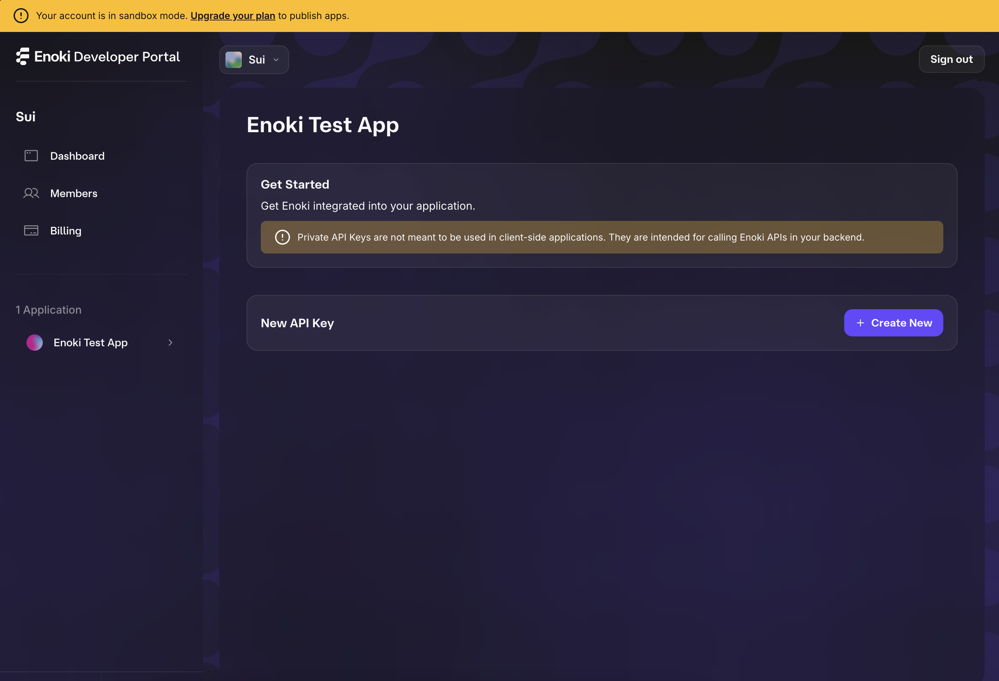

# Enoki Example App
This is a simple, one-page app that integrates with Mysten Lab's Enoki. 

## Getting set up on the Enoki Dev Portal
In order to use Enoki, you need to sign into the Enoki Dev Portal and set up your new project. Below are the steps required for this. 

1. Navigate to the [Enoki Dev Portal](https://portal.enoki.mystenlabs.com) and sign in with the email you want to manage your project with. 

    Note, that during your first time signing in, you'll be asked to provide some info to help Mysten Labs keep informed about who is using Enoki. 

    The portal should look something like this when you successfully log on: 
    

2. Click `+ Create your first App` and enter the name of your app. 

    You should see your project's page on the portal now:
    

3. Click `+ Create new` under `New API Key`. 

    You will be given a prompt that looks like this: 
    

    You'll need to select the following: 

    - API key type: 
      - [ ] Public: Select this type if you plan on using this key in a client-side app
      - [ ] Private: Select this type if you plan on using this key in a private backend server

    - Enabled networks: The Sui networks that this api key will work on
      - [ ] Devnet
      - [ ] Testnet
      - [ ] Mainnet - Note this will only work for published apps

    - Enabled features: The features that this api key will support
      - [ ] zkLogin
      - [ ] Sponsored transactions

    When creating a key for this demo app, select: 
    - [x] Public
    - [x] Testnet
    - [x] zkLogin
    - [x] Sponsored transactions

    Your api key should look something like this: 
    

4. Now you have your Enoki API key! 
    
    To use the key in this demo, make a copy of [.env.template](./.env.template) named `.env.local` and paste in the key into `ENOKI_PUB_KEY`. It should look something like this: 

    ```
    ENOKI_PUB_KEY=enoki_public_1646656193035707ff4ef3aecafb455e
    GOOGLE_CLIENT_ID=
    ```