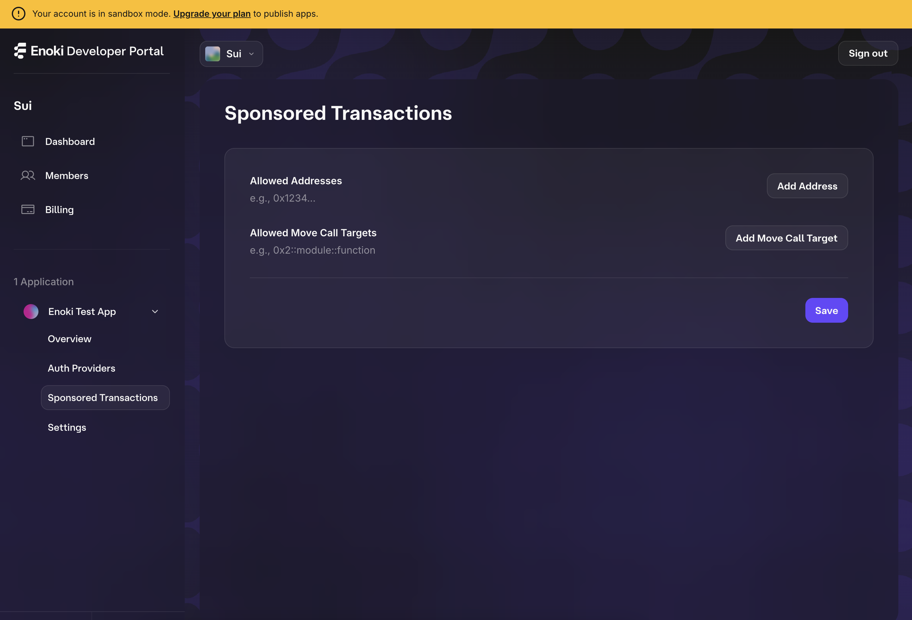
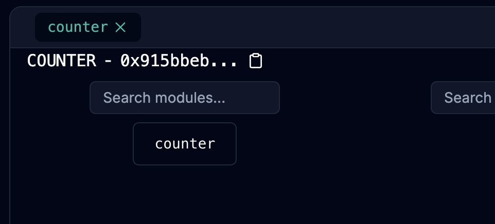

# Enoki Example App
This is a simple, one-page app that integrates with Mysten Lab's Enoki. The live testnet demo can be foud [here](https://enoki-example-app.vercel.app).

Follow the steps below to run your own instance of the app locally.

1. Clone/fork the repository and navigate to the root directory.
2. [Set up your Enoki API keys](#setting-up-enoki-api-keys)
3. [Set up your google client id](#getting-your-google-client-id) and [Enoki Auth Provider](#setting-up-your-enoki-auth-provider).
4. [Deploy and connect your smart contract](#deploying-and-connecting-your-smart-contract).
5. [Set up your Enoki Sponsored Transactions](#setting-up-enoki-sponsor-transactions).
6. Install the dependencies by running `yarn install`.
7. Start the app by running `yarn dev`.
8. Try out your app by logging in with Google and creating a counter!

## Enoki Dev Portal Setup
### Setting up Enoki API keys
In order to use Enoki, you need to sign into the Enoki Dev Portal and set up your new project. Below are the steps required for this. 

1. Navigate to the [Enoki Dev Portal](https://portal.enoki.mystenlabs.com) and sign in with the email you want to manage your project with. 

    Note, that during your first time signing in, you'll be asked to provide some info to help Mysten Labs keep informed about who is using Enoki. You will also be prompted to select your payment plan. Go ahead and skip this for now.

    The portal should look something like this when you successfully log on: 
    

2. Click `+ Create your first App` and enter the name of your app. 

    You should see your project's page on the portal now:
    

3. Click `+ Create new` under `New API Key`. 

    You will be given a prompt that looks like this: 
    

    You'll need to create two keys: one for the zkLogin feature used in the client and one for the sponsored transactions feature used in the backend.

    - **zkLogin key**: 
      - API key type: `Public`
      - Enabled networks: `Testnet`
      - Enabled features: `zkLogin`

    - **Sponsored transactions key**:
      - API key type: `Private`
      - Enabled networks: `Testnet`
      - Enabled features: `Sponsored transactions`

    Your api keys should look something like this: 
    

4. Now you have your Enoki API keys! 
    
    To use the key in this demo, make a copy of [.env.template](./.env.template) named `.env`, and [.env.local.template](./.env.local.template) named `.env.local` and paste the public and private key into `NEXT_PUBLIC_ENOKI_API_KEY` and `ENOKI_SECRET_KEY` respectively. It should look something like this: 

    ```
    NEXT_PUBLIC_ENOKI_API_KEY=enoki_public_aa763a9d36bb6aa1e41062dd67df2518
    ```

    ```
    ENOKI_SECRET_KEY=enoki_private_905204de81012fd7422a9902907f112c
    ```

You have successfully set up your Enoki API keys! Continue to the next steps in [setting up your app](#enoki-example-app)

### Setting up your Enoki Auth Provider
To use the *zkLogin* feature, you will need to connect your auth provider to the Enoki Dev Portal. 

1. Navigate to the `Auth Providers` section of your Enoki project. 

    The Auth Providers section is where you can add and manage your app's auth providers. 

    It should look like this: 
    

2. Click `+ New Auth Provider`

    You will be given a prompt that looks like this: 
    

    When creating a key for this demo app, select `Google` and paste your google client id. Follow the [instructions](#getting-your-google-client-id) to get your client id from Google.

    Your auth provider should look something like this: 
    

3. Now you have your Enoki Auth Provider! 

    Paste the client id into the [`.env`](./.env) file. It should look something like this: 

    ```
    NEXT_PUBLIC_GOOGLE_CLIENT_ID=277348171272-epn1s82k6bmumooapalnsdq0lu19d27t.apps.googleusercontent.com
    ```

    Note that you can add more auth providers by repeating the steps above.

4. You have successfully connected your auth provider to Enoki! Continue to the next steps in [setting up your app](#enoki-example-app)

### Setting up Enoki Sponsor Transactions
In the Enoki Dev Portal, you can set up *Sponsored Transactions* by adding addresses and move targets that are supported. 

1. Navigate to the `Sponsored Transactions` section of your Enoki project. 

    The Sponsored Transactions section is where you can add and manage the addresses and move targets that you want to be supported in sponsored transactions. 

    It should look like this: 
    

2. Add the addresses and move call targets you want to be supported. 

    Any allowed addresses are senders that can use sponsored transactions. Any allowed move call targets are functions operations that any of your users can use sponsored transactions for. 

    This app supports the following move call targets: 
    - `{PACKAGE_ID}::counter::create`
    - `{PACKAGE_ID}::counter::increment`
    - `{PACKAGE_ID}::counter::set_value`

    NOTE: Use the package ID you got from [deploying your smart contract](#deploying-and-connecting-your-smart-contract) to get the move call targets. Replace `{PACKAGE_ID}` with the package ID you got from deploying your smart contract.

    Your allow list should look something like this: 
    

3. You have successfully set up your Enoki Sponsored Transaction allow list! Continue to the next steps in [setting up your app](#enoki-example-app)


## Getting your Google Client ID
You will need to set up a Google Auth API key to use the Google Sign-In feature in this demo app.

1. Navigate to the [Google Developers Console](https://console.cloud.google.com/apis/credentials).
2. Click `+ Create Credentials` and select `OAuth client ID`.

    

3. Select `Web application` as the application type.
4. Add `http://localhost:3000/auth` to the `Authorized redirect URIs`.

    Your setup should look something like this:
    
5. Click `Create` and copy the client id.

    Your OAuth client info should look something like this:
    

6. You can now paste this client id into the `.env` file as described in the [Setting up your Enoki Auth Provider](#setting-up-your-enoki-auth-provider) section.
   
## Deploying and connecting your smart contract
This demo app uses a simple Sui smart contract that allows anyone to create global counters that anyone can increment but only the creator can reset. To deploy this contract, follow the steps below:

1. Navigate to [Move Studio IDE](https://movestudio.dev/build).
2. Connect your wallet (make sure your wallet is on testnet). 
3. Click `New Project` and select `Upload`.
4. Select `Choose File` and choose the [Counter Sui module directory](./move/counter/). 
5. Click `Deploy` under the `Tools` section in the left sidebar and approve the transaction in your wallet. 
6. After the package window appears, copy the package ID and paste it into the `.env.local` file as the `PACKAGE_ID` variable.  It should look something like this:

    ```
    PACKAGE_ID=0x7b6a8f5782e57cd948dc75ee098b73046a79282183d51eefb83d31ec95c312aa
    ```

